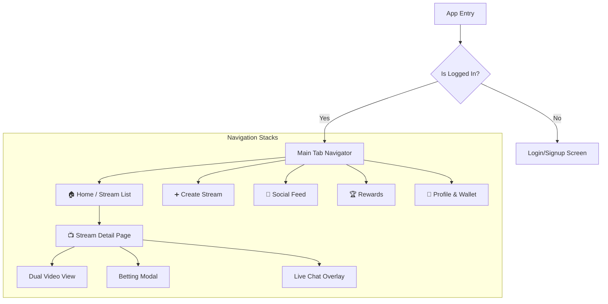

# Application Architecture & Web Migration Strategy

This document outlines the current high-level architecture of PlayaApp and provides a strategic roadmap for building the generic implementation in Next.js.

## 1. High-Level Architecture Diagram

The system relies on a **Hybrid Web2/Web3** architecture. The core video infrastructure is offloaded to the LiveKit Edge Network, while business logic resides on a centralized Node.js server, and value management (bets) interacts with the Solana Blockchain.

```mermaid
graph TD
    subgraph Client_Side ["📱 Client Layer (Mobile/Web)"]
        UI[User Interface]
        Auth[Auth Service<br/>(BetterAuth/Dynamic)]
        LKS[LiveKit Service<br/>(WebRTC Manager)]
        Wallet[Solana Wallet<br/>(Phantom/Embedded)]
    end

    subgraph Backend_Layer ["☁️ Backend Layer (Fly.io)"]
        API[Node.js API]
        DB[(Database)]
        Token_Gen[LiveKit Token<br/>Generator]
    end

    subgraph Infrastructure ["📡 Infrastructure"]
        LK_Cloud[LiveKit Cloud<br/>(SFU / Streaming)]
        Solana[Solana Blockchain<br/>(Transactions)]
    end

    %% Flows
    UI -->|1. Login/Connect| Auth
    Auth -->|2. Verify| API
    UI -->|3. Get Stream Info| API
    API -->|4. Return Room Token| UI
    UI -->|5. Connect via Token| LKS
    LKS <-->|6. Publish/Subscribe A/V| LK_Cloud
    UI -->|7. Place Bet| Wallet
    Wallet -->|8. Confirm Tx| Solana
    Solana -->|9. Indexer/Webhook| API
```

---

## 2. Current Architecture Breakdown

### A. The "Dual-Stream" Logic
The unique selling point of PlayaApp is the "Head-to-Head" view.
1. **Room orchestration**: Both streamers join the *same* LiveKit room.
2. **Role assignment**: The Backend determines if a user is `Player1`, `Player2`, or a `Viewer` based on wallet address or user ID during the API `join` call.
3. **Metadata**: The backend injects this role into the `participant.metadata`.
4. **Client Rendering**:
   - The client (`DualStreamerView.tsx`) listens for all video tracks in the room.
   - It filters tracks: `if (metadata.position == 1) renderLeft(); else renderRight();`
   - This ensures synchronization because both video feeds arrive via the same WebRTC connection.

### B. State Management (Current)
- **Auth state**: Handled by React Context (`AuthProvider`).
- **Video state**: Managed by the LiveKit SDK internal state (tracks, participants).
- **UI state**: Mostly local `useState` within screens.

---

## 3. Next.js Web Architecture Strategy

Moving to Next.js allows you to leverage Server Side Rendering (SSR) for SEO and initial load speed, while keeping the rich interactivity of the video stream.

### Recommended Stack
- **Framework**: Next.js 14+ (App Router)
- **Rendering**: Server Components (RSC) for shells; Client Components for video.
- **Styling**: Tailwind CSS (Utility classes are faster to parse than CSS-in-JS).
- **State**: **Zustand** (Global UI) + **TanStack Query** (Server Data).

### Architecture Changes for Web

#### 1. Server Components vs Client Components
Don't make everything a Client Component (`'use client'`).
- **Server Components**: Use for the layout shell, fetching the stream title, streamer bios, and initial SEO metadata.
- **Client Components**: The `<LiveKitRoom>` and `<VideoTrack>` components must be client-side because they use browser APIs (window, navigator).

#### 2. Responsiveness (The Grid System)
Hardware screens are variable. We replace absolute dimensions with a CSS Grid system.

**Conceptual Grid Layout:**
```
[ Mobile Protrait ]      [ Desktop / Tablet Landscape ]
+-----------------+      +---------------------+---------------------+
|   Streamer 1    |      |                     |                     |
|  (Aspect 16:9)  |      |      Streamer 1     |      Streamer 2     |
+-----------------+      |                     |                     |
|   Streamer 2    |      |                     |                     |
|  (Aspect 16:9)  |      +---------------------+---------------------+
+-----------------+      |           Chat & Betting Overlay          |
|      Chat       |      +-------------------------------------------+
+-----------------+
```

### 3. State Management for Speed

To make the app feel "instant", distinct types of state should be handled differently:

**A. Server Data (TanStack Query)**
- **Why?** Caches API responses. If a user navigates away and back, the data is instant.
- **Usage**: Fetching list of active streams, user profiles, history.

**B. Global UI State (Zustand)**
- **Why?** Context API triggers re-renders on the whole tree. Zustand allows components to subscribe only to the slices they need.
- **Usage**: "Is Chat Open?", "Selected Bet Amount", "Current Theme".

**C. Media State (LiveKit SDK)**
- **Do not wrap LiveKit state in Redux/Zustand.** The LiveKit SDK is highly optimized. Use the provided hooks (`useTracks`, `useParticipant`) directly in components to ensure you get the absolute fastest video frame updates.

### 4. Application Flow (Next.js)

1. **User visits `/stream/[id]`**:
   - **Server**: Fetches stream details from API. Generates OG tags (Social Cards).
   - **Client**: Hydrates. Calls `/api/token` to get a LiveKit JWT.
2. **Room Connection**:
   - `<LiveKitRoom>` component mounts.
   - Connects to WebSocket.
3. **Adaptive Bitrate**:
   - On Web, LiveKit automatically downgrades video quality if the window size is small (e.g., in a small grid cell), saving massive amounts of bandwidth and CPU.

---

## 5. User Interface Flow & Structure

This section maps the current mobile screens to the planned Web Architecture.

### A. Navigation Hierarchy (Mobile vs Web Strategy)



### B. Detailed Screen Architectures

#### 1. **Home / Stream List (`/user/home`)**
*   **Purpose**: The main landing page showing active matches.
*   **Key Components**:
    *   **Hero Slider**: Featured "Hot" matches.
    *   **Tab Switcher**: Toggle between "Live Now" and "Ended/VODs".
    *   **Stream Card**: Shows specific matchup (Player A vs Player B), Viewer Count, and "Betting Pool Size".
*   **Web Implementation**: `/app/page.tsx` (Dashboard).

#### 2. **Stream Detail Page (`/stream/[id]`)**
*   **Purpose**: The core interactive experience. This is the most complex screen.
*   **Architecture Diagram**:
    ```text
    +-----------------------------------------------------------+
    |  [Header] Back Button | Stream Title | Viewers | Wallet   |
    +-----------------------------------------------------------+
    |                                                           |
    |          +-------------------+-------------------+        |
    |          |                   |                   |        |
    |          |    Streamer 1     |    Streamer 2     |        |
    |          |   (Video Feed)    |   (Video Feed)    |        |
    |          |                   |                   |        |
    |          +-------------------+-------------------+        |
    |                                                           |
    |  [Betting Bar]  50% on P1  <====>  50% on P2              |
    +-----------------------------------------------------------+
    |  [Tabs]  Chat  |  Bets  |  Stats                          |
    |                                                           |
    |  (Scrollable Chat Area)                                   |
    |  User1: Let's goOOO!                                      |
    |  User2: Bet placed on P1                                  |
    +-----------------------------------------------------------+
    |  [Input] Type a message...                 [Bet Button]   |
    +-----------------------------------------------------------+
    ```
*   **State Management Strategy**:
    *   **Video layout**: Handled by CSS Grid (Responsive).
    *   **Chat**: WebSocket subscription (LiveKit Data Channel).
    *   **Betting Modal**: Global UI State (Zustand) triggers an overlay.

#### 3. **Profile & Wallet (`/profile`)**
*   **Purpose**: Manage identity and crypto funds.
*   **Key Components**:
    *   **Wallet Card**: Shows SOL Balance & Address.
    *   **Bet History**: Tabs for `Active`, `Won`, `Lost`.
    *   **Settings**: Stream key management.

#### 4. **Create Stream (`/create`)**
*   **Purpose**: Set up a new competitive match.
*   **Flow**:
    1.  Enter Title/Description.
    2.  **Select Opponent**: Search user database to invite "Player 2".
    3.  Set Entry Fee / Starting Pot.

---

## 6. Performance Optimization Checklist

To ensure the web app runs at 60fps even on low-end laptops:

1. **Image Optimization**: Use `next/image` for user avatars to auto-resize them.
2. **Lazy Loading**: Use `next/dynamic` to load the heavy `LiveKitRoom` component only after the page shell has painted.
3. **CSS Containment**: Use CSS `contain: paint` on video containers to prevent browser reflows affecting the chat.
4. **WebSocket separation**: Ensure Chat and Video don't block the main thread. LiveKit handles this internally via Web Workers where supported.
